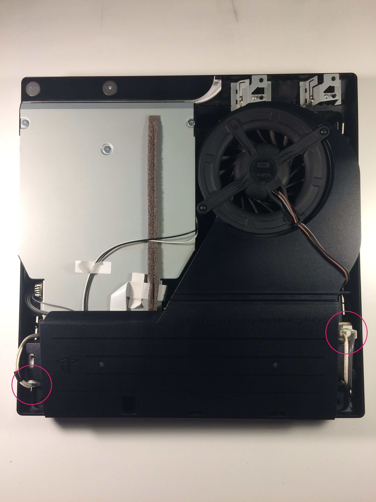

# PS3 PWM Fan Control

## Problem

Playstation 3 is suffering from overheating due to it being stored in a small, enclosed space. 

 ## Solution
 
 Use the pulse width modulation signal(PWM) generated by the Playstation 3 for it's internal fan in conjuntction with an Arduino Mega to control an external fan that circulates air inside the enclosed space, for the ultimate goal of significantly reducing or completely elimnating overheating problems.

## Criteria

The goal is to use a Y splitter cable to split the PWM signal coming from the inside the console. Then using one of the outputs to drive the internal fan, leaving the original Playstation 3 cooling unaffected. The cable carrying the second output will be routed oustide the Playstation and will be read in by the Arduino. From here the Arduino will either pass the original signal onto the external fan unaffected or if requested by the user the signal can be modified, effectively changing the speed of the external fan. This communication will be done over a Arduino Ethernet Shield.

## Procedure

 1. Dissasemble Playstation 3 to reach internal fan and PWN connector. I removed a handful of philips and tamper proof torx screws from the bottom of the console, then flipping the console over the top cover could be lifted off exposing the fan and its wires, one of which is the PWM, the other two being GND and +12V. The origin of these wires seemed to be coming from under the power supply. I simply unplugged the two connectors circled below and I was then able to remove the power supply. 
 

 
 
