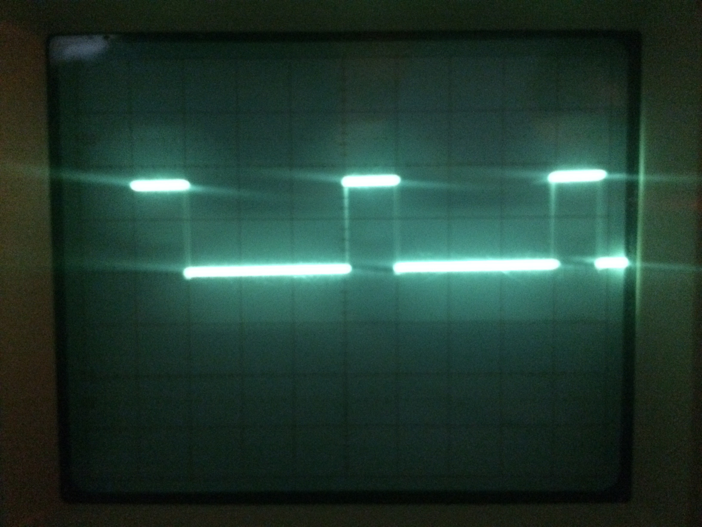
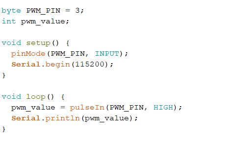
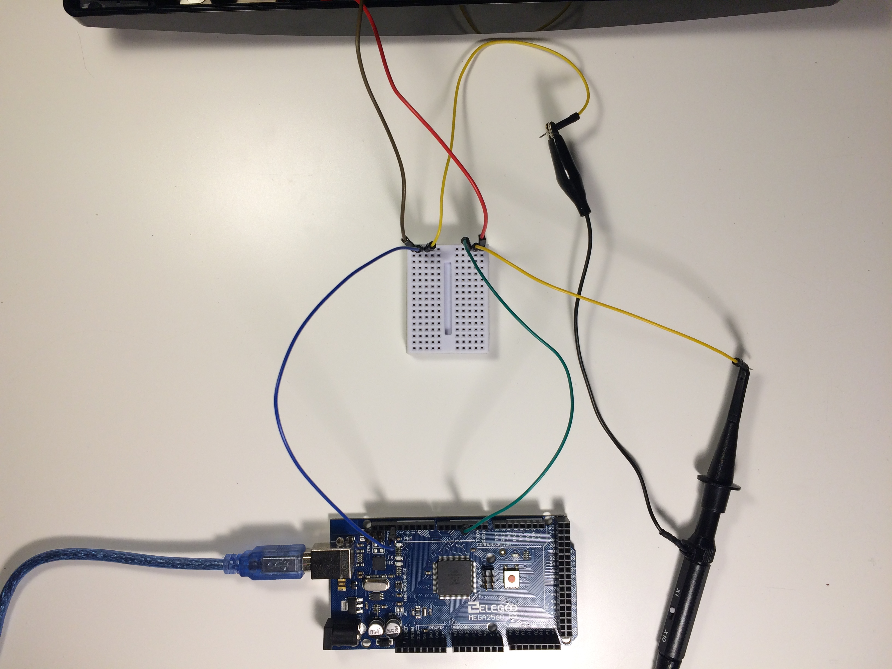
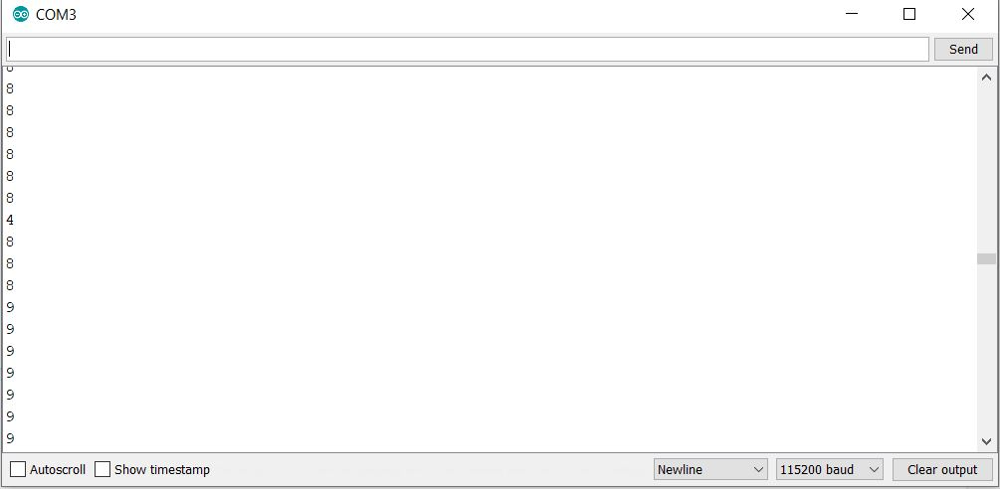

# PS3 PWM Fan Control

## Problem

Playstation 3 is suffering from overheating due to it being stored in a small, enclosed space. 

 ## Solution
 
Use the pulse width modulation signal(PWM) generated by the Playstation 3 for it's internal fan in conjuntction with an Arduino Mega to control an external fan that circulates air inside the enclosed space, for the ultimate goal of significantly reducing or completely elimnating overheating problems.

## Criteria

My goal is to use a Y splitter cable to split the PWM signal coming from the inside the console. Then using one of the outputs to drive the internal fan, leaving the original Playstation 3 cooling unaffected. The cable carrying the second output will be routed oustide the Playstation and will be read in by the Arduino. From here the Arduino will either pass the original signal onto the external fan unaffected or if requested by the user the signal can be modified, effectively changing the speed of the external fan. This communication will be done over a Arduino Ethernet Shield.

## Procedure

I dissasembled the Playstation 3 to reach internal fan and PWM connector. I started by removing a handful of philips and tamper proof torx screws from the bottom of the console, then flipping the console over and lifting the top cover off to expose its fan and wires, one of which is the PWM, the other two being GND and +12V. The origin of these wires seemed to be coming from under the power supply. I simply unplugged the two connectors circled below and I was then able to remove the power supply. 
 
 

Once the power supply was removed it was easy to see where the fan wires originated from, simply pulling up on the connector was enough to unplug it. With some research I was able to find out that the Grey wire is the PWM, the Brown is +12V and the Black is GND [1].

 

Once I had access to where the PWM signal came from I decided to analayze it, mostly due to the fact that information about the frequency and amplitude are sparse. This proved to be challenging as the power supply had to be installed again to run the Playstation, making it impossible to attach a oscilloscope probe and ground directly, it was also near impossible to measure where the wires attached to the fan as they were encased in plastic. I solved this by using 2 male to female jumper wires from my Arduino kit, then removing the plastic shells on the female end of the wires and crimping down the size with pliers to make them fit snuggly on the the male end located under the power supply, this was also done because with the plastic shells still installed the female end would not fit into the original connector. These two wires were connected to GND and PWM. I also took the precatiuon of wrapping a small bit of electrical tape around the now exposed female ends to make sure there were no short circuits once I began testing. Below is a picture of the female end with its plastic shell removed in the process of being crimped.

 
 
After the wires were prepared I connected them as shown below. 
 
 
  
Then I installed the power supply again also reconnecting the two connectors I had prevously disconnected during inital disassembly. The probe and ground were now connected to the male ends of the jumper wires. 
  
 
 
 Now it was time to locate the actual signal on the oscilloscope. From my research into using PWM for controlling a fan I knew a couple things, first and foremost I was looking for a DC signal (square wave), secondly I knew that the frequency was going to be in a range of 20-28kHz [2], and lastly I knew that the amplitude of the square wave could be in the range of 3.3-5V [2]. Using the given range of frequencies I calculated the range of periods I could expect to be from 35.7 to 50 microseconds, I could then approximate the TIME/DIV  to set the oscilloscope to, as well as that knowing the potential range of amplitude I set my VOLTS/DIV accordingly. With this I started adjusting the scope to find the signal, the fan had to be left unplugged during this time so I made sure not to have the Playstation run continiusly as I did not want to damage the components. Barring a few hiccups I eventually found my signal as shown below. 
   
 
 
 Positioning the signal so that it lined up as squarely with the grid as possible I easily calculated the period to be 40 micro seconds (TIME/DIV = 10 micro seconds), this period gives a frequecny of 25kHz which upon further research appears to be a common target frequecny for some fans [2]. I was also able to read the amplitude of the wave to be 3.2V (VOLTS/DIV = 2V) which also seemed to be a acceptable value, I believe that I may have introduced some error when I read it off the scope and it was was most likely 3.3V. Wanting to analyze it further I found code [3] shown below, that was able to read in a PWM signal and return the time in micro seconds that the signal was on "HIGH". I then took that number and divided it by the period, that will give you the duty cycle, multiplying that ratio by 100 gives the duty cycle in percentage. 
 
 
 
 I wanted to observe the duty cycle of the wave change while I also watched duration pulse change on the serial monitor. To do this simultaneously I used a breadboard and some jumper wires to connect the GND coming from the Playstation to both the ground on the Arduino and the ground of the probe, I did something similar for the PWM wire, except one went into the digital pin 3 of the arduino and the other to the probe. 
 
 
 
With the wiring completed as shown above I started testing. The testing started at room temperature or with the Playstation 3 completely cooled down. This testing was purely done to observe how the PWM signal changes as function of CPU/GPU temperature and to ensure the above code worked as needed. So when initally switched on the duty cycle was 30% (a pulse width of 12 micro seconds as measured by Arduino), after ~4 seconds it dropped down to  20% duty cycle(8 micro seconds). The pulse width then linearly increased in 1 micro second intervals until the duty cycle was at 40% (16 microsecond pulse width). Further increases in duty cycles happened at a more exponential rate. After 40% it jumped to 50%, then 67.5% and lastly 99%. And then upon shutdown of console the duty cycle momentarily dropped down to 20% again before the console was fully off. It should be noted that the duty cycles mentioned above were calculated by dividing the pulse widths read in by the Arduino by the period. There was some extraneous data observed from the Arduino as seen below. Although it was relatively uncommon to see this type of data it was still noted down in case there was a need to address it at a later date if there was unwanted behaviour from the external fan. 

 
 
 basically what is the ouput of said code (screenshot) and what is the circuit I had to build in order for arduino and oscillisope to both use the two wires coming from ps3(pic)
 also descrive how the duty cycle changes, when it boots up it foes to 12? then drops down to 8 then linearly increases up to 12/13/14 then makes a couple jumps from like 30% to 50% to 100% duty cycle. ALso talk about how measuring the voltage across it and dividing that by 3.3V gives you the duty cycle and how it MAY have been possibke to build maybe a voltage divider to calculate the duty cycle??
 
 
 ## Citations
 
 [1]    @oldturkey03 (2011, Jun. 20). *PS3 Fan wires explained* [Online fourm]. Available: https://www.ifixit.com/Answers/View/55562/PS3+Fan+wires+explained#answer55577 [Accessed: Nov. 7, 2020]
 
 [2]   *"4-Wire Pulse Width Modulation (PWM) Controlled Fans"* Sep. 2005. Accessed on: Nov. 7, 2020. [Online]. Available: https://wiki.kobol.io/helios4/files/fan/4_Wire_PWM_Spec.pdf
 
 
 [3]    B. Ripley, *Three Ways To Read A PWM Signal With Arduino*, Jun. 2014. Accessed on: Nov. 7, 2020. [Online]. Available: https://www.benripley.com/diy/arduino/three-ways-to-read-a-pwm-signal-with-arduino/
 
 
 
