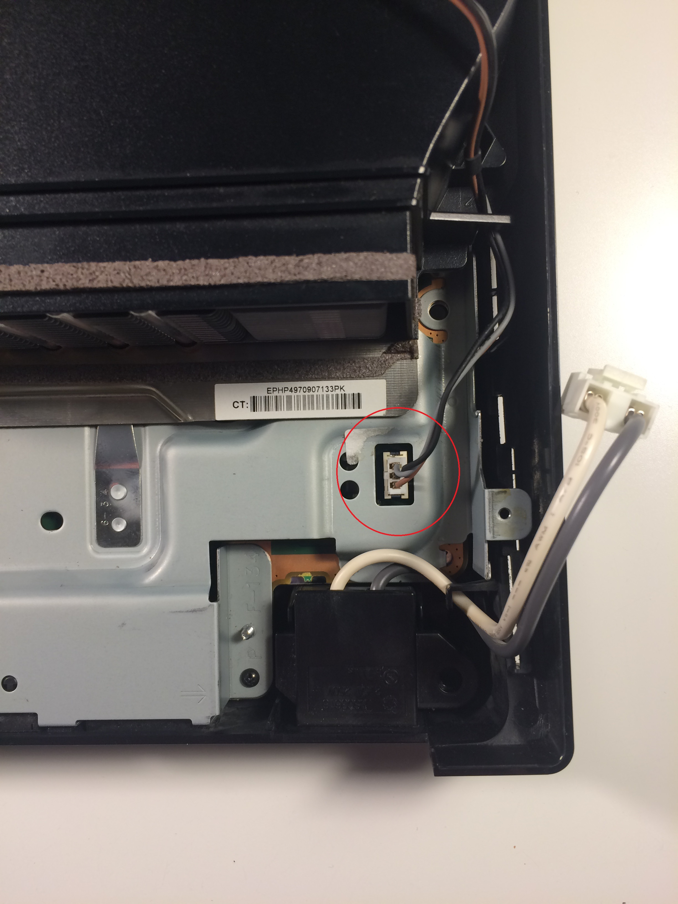
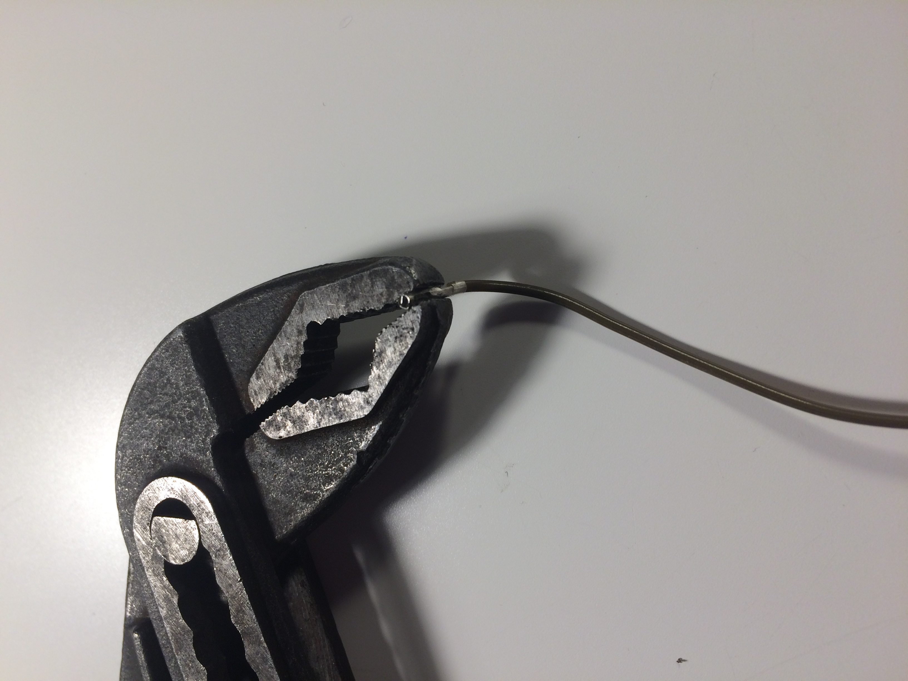
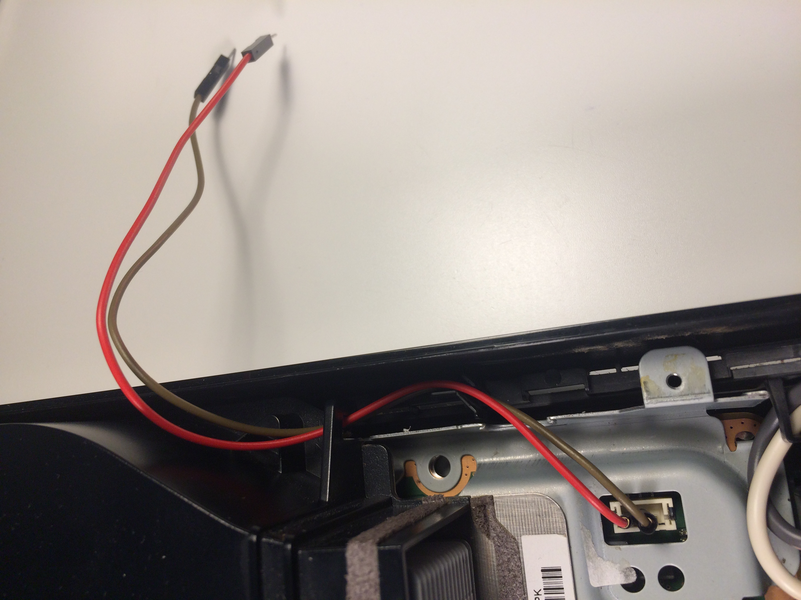
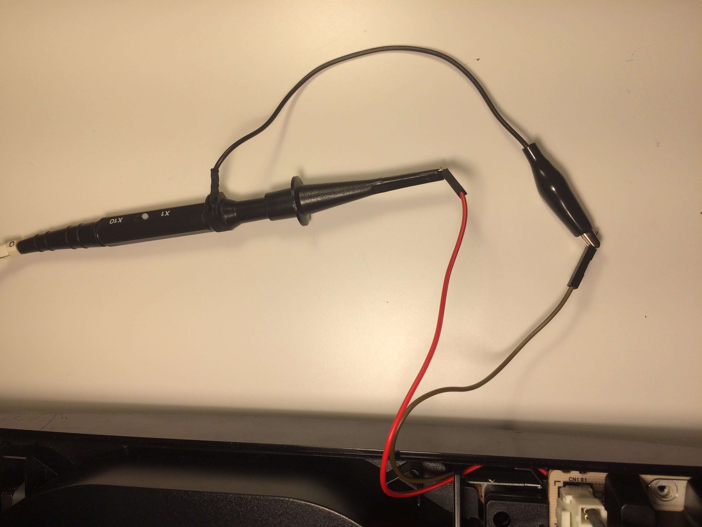

# PS3 PWM Fan Control

## Problem

Playstation 3 is suffering from overheating due to it being stored in a small, enclosed space. 

 ## Solution
 
Use the pulse width modulation signal(PWM) generated by the Playstation 3 for it's internal fan in conjuntction with an Arduino Mega to control an external fan that circulates air inside the enclosed space, for the ultimate goal of significantly reducing or completely elimnating overheating problems.

## Criteria

My goal is to use a Y splitter cable to split the PWM signal coming from the inside the console. Then using one of the outputs to drive the internal fan, leaving the original Playstation 3 cooling unaffected. The cable carrying the second output will be routed oustide the Playstation and will be read in by the Arduino. From here the Arduino will either pass the original signal onto the external fan unaffected or if requested by the user the signal can be modified, effectively changing the speed of the external fan. This communication will be done over a Arduino Ethernet Shield.

## Procedure

I dissasembled the Playstation 3 to reach internal fan and PWM connector. I started by removing a handful of philips and tamper proof torx screws from the bottom of the console, then flipping the console over and lifting the top cover off to expose its fan and wires, one of which is the PWM, the other two being GND and +12V. The origin of these wires seemed to be coming from under the power supply. I simply unplugged the two connectors circled below and I was then able to remove the power supply. 
 
 

Once the power supply was removed it was easy to see where the fan wires originated from, simply pulling up on the connector was enough to unplug it. With some research I was able to find out that the Grey wire is the PWM, the Brown is +12V and the Black is GND. 

 

Once I had access to where the PWM signal came from I decided to analayze it, mostly due to the fact that information about the frequency and amplitude are sparse. This proved to be challenging as the power supply had to be installed again to run the Playstation, making it impossible to attach a oscilloscope probe and ground directly, it was also near impossible to measure where the wires attached to the fan as they were encased in plastic. I solved this by using 2 male to female jumper wires from my Arduino kit, then removing the plastic shells on the female end of the wires and crimping down the size with pliers to make them fit snuggly on the the male end located under the power supply, this was also done because with the plastic shells still installed the female end would not fit into the original connector. These two wires were connected to GND and PWM. I also took the precatiuon of wrapping a small bit of electrical tape around the now exposed female ends to make sure there were no short circuits once I began testing. Below is a picture of the female end with its plastic shell removed in the process of being crimped.

 
 
After the wires were prepared I connected them as shown below. 
 
 
  
Then I installed the power supply again also reconnecting the two connectors I had prevously disconnected during inital disassembly. 
  
 
